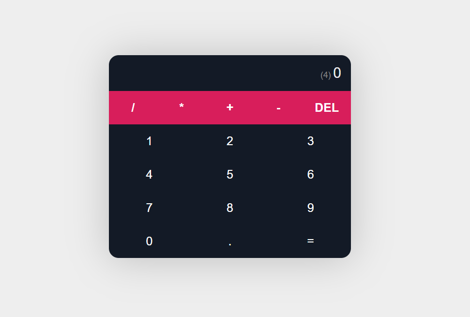

# Calculator Application



## Overview
The **Calculator Application** is a user-friendly, interactive web-based calculator built using . This application allows users to perform basic arithmetic operations such as addition, subtraction, multiplication, and division. Its intuitive interface and responsive design make it accessible across desktop, tablet, and mobile devices.

## Features
- **Simple Arithmetic Operations**: Supports addition (+), subtraction (-), multiplication (*), and division (/).
- **Responsive Design**: Works seamlessly on desktops, tablets, and mobile devices.
- **Interactive UI**: Clear and user-friendly interface with button-based input.
- **Live Calculation Display**: View real-time updates of inputs and results as you type.

## Technologies Used
- **React**: For building the dynamic, component-based user interface.
- **HTML5 & CSS3**: For layout and styling.
- **JavaScript (ES6)**: For logic and interactivity.

## Installation
To run the Calculator Application locally, follow these steps:

1. **Clone the repository**
   ```bash
   git clone https://github.com/your-username/calculator-react.git
   cd calculator-react
   ```

2. **Install dependencies**
   ```bash
   npm install
   ```

3. **Start the development server**
   ```bash
   npm start
   ```

The application will be accessible at `http://localhost:3000/`.

## Usage
1. Launch the application in a web browser.
2. Use the on-screen buttons to input numbers and operators.
3. View the result on the display in real-time.
4. Click the "AC" button to clear the input and start a new calculation.


## Available Scripts
- **`npm start`**: Runs the app in development mode.
- **`npm build`**: Builds the app for production.
- **`npm test`**: Launches the test runner.

## Possible Enhancements
- **Scientific Calculator Features**: Add trigonometric, logarithmic, and exponential functions.
- **History of Calculations**: Maintain a log of past calculations for reference.
- **Themes**: Add light and dark mode toggle options.

## Contributing
Contributions are welcome! To contribute:
1. Fork the repository.
2. Create a new branch (`git checkout -b feature/your-feature-name`).
3. Commit your changes (`git commit -m 'Add new feature'`).
4. Push to the branch (`git push origin feature/your-feature-name`).
5. Open a Pull Request.

## License
This project is licensed under the **MIT License**. See the [LICENSE](LICENSE) file for more details.

## Contact
For questions, feedback, or contributions, please reach out via [your email] or open an issue on the [GitHub repository](https://github.com/your-username/calculator-app).
